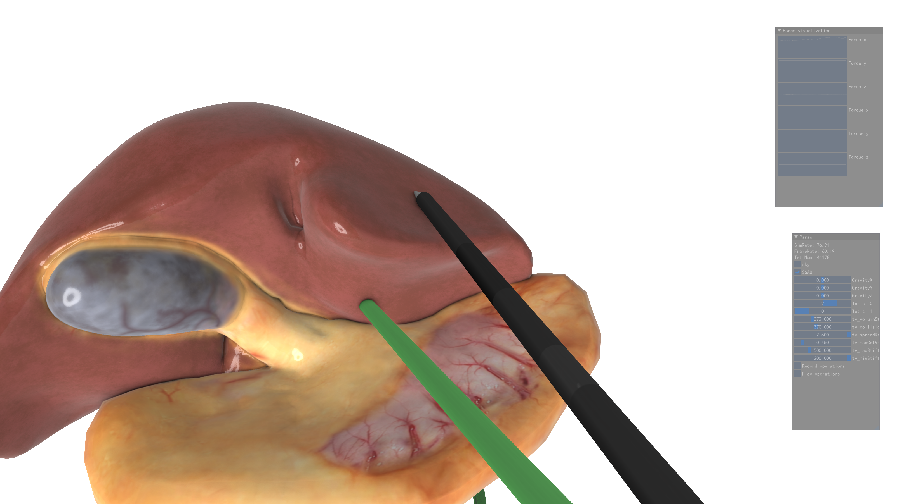
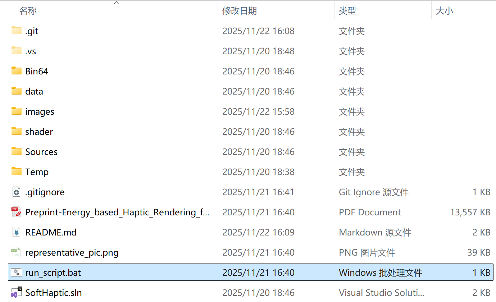
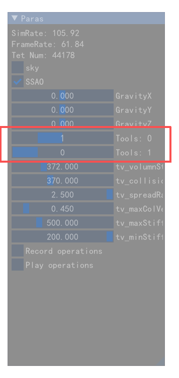
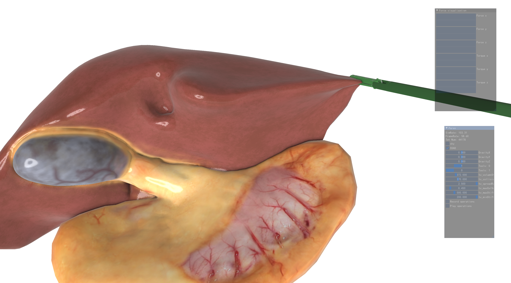

This is an interactive software replicating "Energy-based Haptic Rendering for Real-time Surgical Simulation". 

Required platform: Windows.

Required hardware: Nvidia graphical card

Recommended hardware: Phantom Touch(P.S. When the program detected available haptic device, it will automatically allow the user move the surgical tool with manipulandom, otherwise, it will play the recorded track of surgical tool. )

Required software: Visual Studio, CUDA 12.1 

There is a pre compiled binary file: Bin64/bin/SoftHaptic.exe . 

To execute this file, run the bat file in root directory of this project: run_script.bat

if the Phantom Touch driver and CUDA is installed correctly, a window with a scene of liver surgery will pop up.

**Instruction**

1. Download this repository as zip and unzip it
2. Goto the root directory of this program
3. Double click and run_script.bat
   
4. In the poped up window, you can change the point of view of camera.mouse left click and drag: rotate camera; mouse right click and drag: transform camera; Scroll the wheel to adjust the distance of the camera.
5. Use the slider to change the tool type. There are totally 2 types of surgical tool: grasper and electric hook(type 0: empty tool; type 1: grasper tool; type 2: electric hook)
   
6. Grasper tool: Press button 1 on Phantom touch to close the grasper. When the tool is completely closed, move the manipulandum to pull the grasped part of soft body. 
   
   Note: In this updated version, we provide a recorded motion track of surgical tool, including grasping operation. 
   
7. Electric hook: Use the manipulandum to move the hook. This tool can simply press the soft body and insert into narrow gaps.

Examples：

