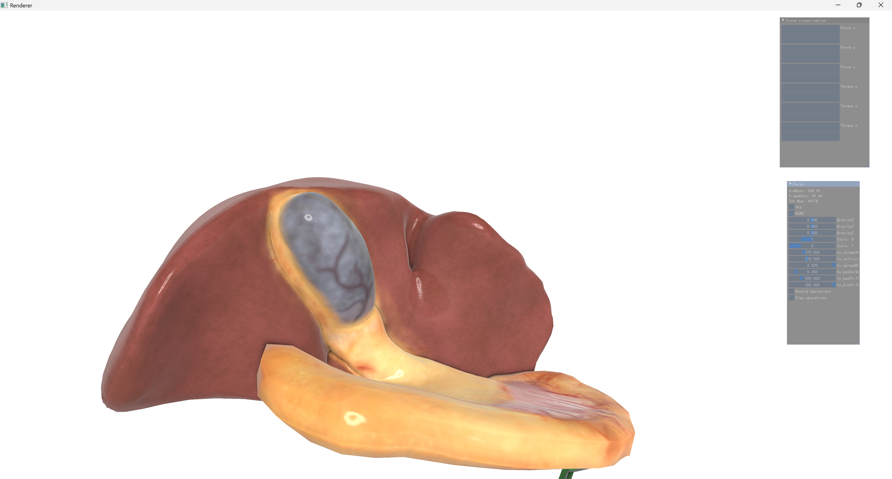
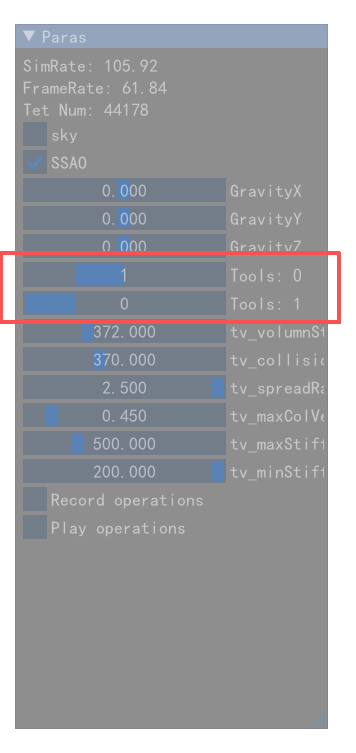
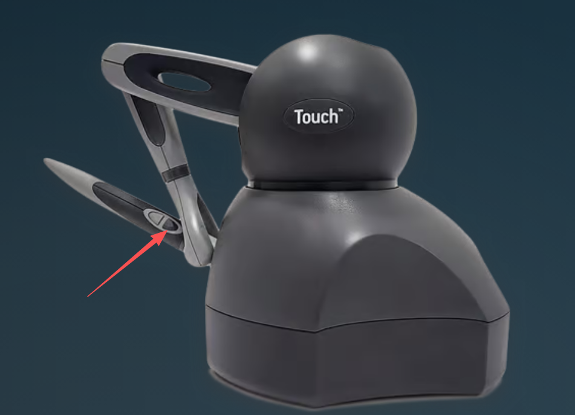

This is an interactive software replicating "Energy-based Haptic Rendering for Real-time Surgical Simulation". 

Required platform: Windows.

Required hardware: Phantom Touch, Nvidia graphical card(GTX 3080 VRAM 12GB)
P.S. The vram requirement of our program is low, The 12GB of VRAM actually far exceeds the amount of VRAM we actually use

Required software: Visual Studio, CUDA 12.1 

There is a pre compiled binary file: Bin64/bin/SoftHaptic.exe . 

To execute this file, run the bat file in root directory of this project: run_script.bat

if the Phantom Touch driver and CUDA is installed correctly, a window with a scene of liver surgery will pop up.

**Instruction**

1. Download this repository as zip and unzip it
2. Goto the root directory of this program
3. Run run_script.bat
4. Use the slider to change the tool type(type 0: empty tool; type 1: grasper tool; type 2: electric hook)

5. Grasper tool: Press button 1 on Phantom touch to close the grasper. When the tool is completely closed, move the manipulandum to pull the grasped part of soft body.

6. Electric hook: Use the manipulandum to move the hook. This tool can simply press the soft body and insert into narrow gaps.
